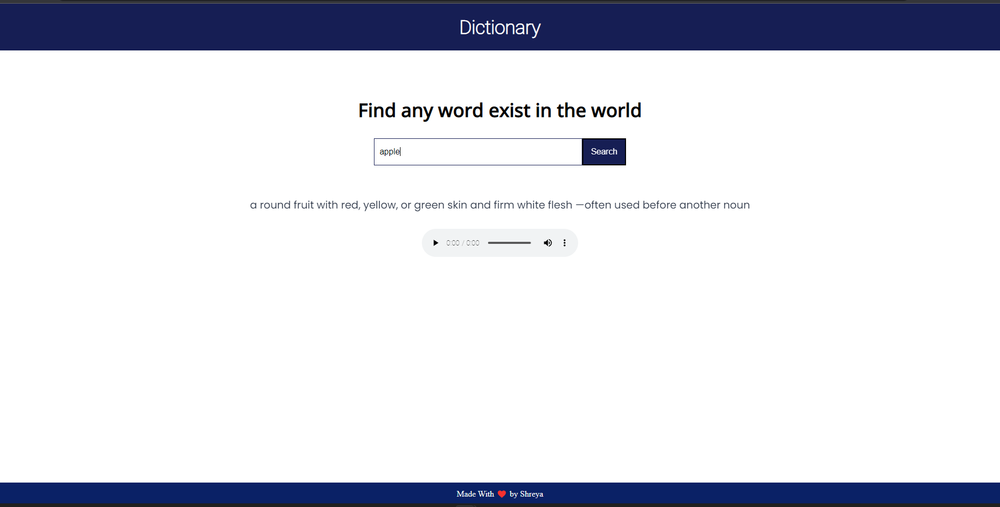
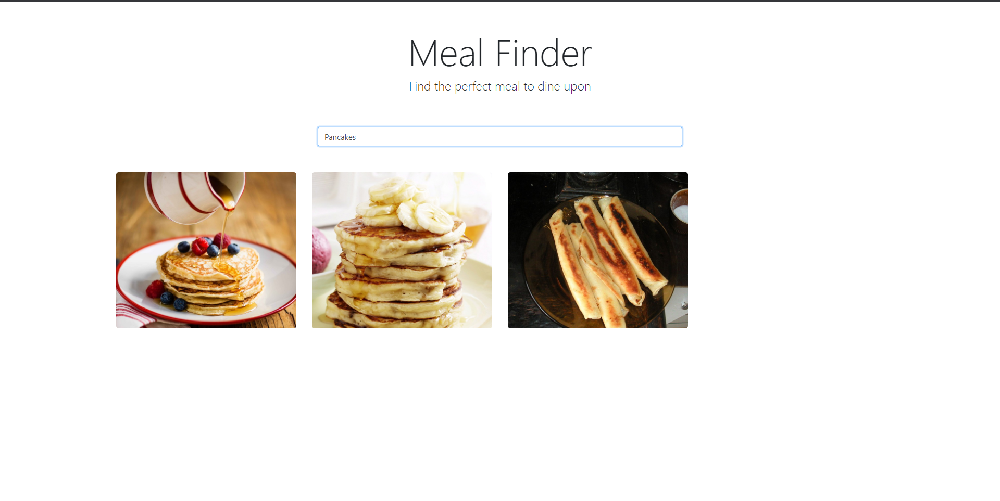
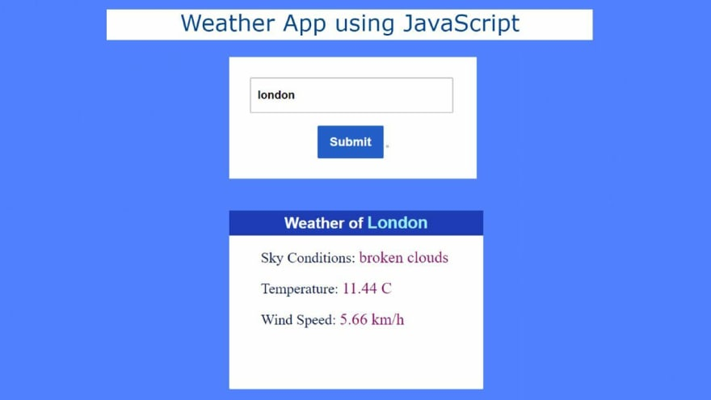

## 1. Github Finder 

Get details of users by typing their name on searchbox.

<a href="https://amanmishra11.github.io/js-projects/github_user_search/">Visit</a>

## 2. Dictionary app 

<a href="https://amanmishra11.github.io/js-projects/dictionary/">Visit</a>

## 3. Meal finder 

<a href="https://amanmishra11.github.io/js-projects/find_food/food.html">Visit</a>

## 4. Real-time Weather app

## 4. Emoji Finder

<a href="https://amanmishra11.github.io/js-projects/emoji/">Visit</a>

## 4. Find weight relative to each Planet of our Solar System

<a href="https://amanmishra11.github.io/js-projects/solar_system/">Visit</a>

